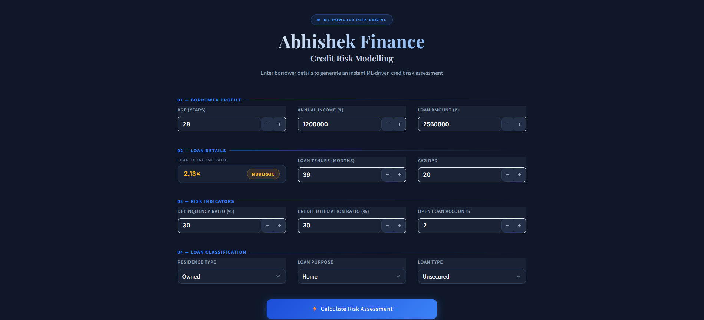

# 📊 Abhishek Finance — Credit Risk Modelling

A machine learning-based web application that predicts credit default probability, generates a credit score (300–900), and assigns a risk rating for loan applicants — built with **Logistic Regression**, **Scikit-learn**, and **Streamlit**.

---

## 🖥️ Live Preview

> Run locally with `streamlit run app.py`



---

## 📌 Project Overview

This project builds an end-to-end **credit risk assessment system** using classical machine learning. Given a borrower's financial and loan details, the model:

1. Predicts the **probability of loan default**
2. Converts it into a **credit score** on a 300–900 scale
3. Assigns a **risk rating**: Poor, Average, Good, or Excellent

The web app provides an interactive UI where users can enter borrower information and get an instant risk assessment.

---

## 🧠 Machine Learning Details

| Component | Details |
|-----------|---------|
| Algorithm | Logistic Regression |
| Preprocessing | MinMaxScaler |
| Output | Default probability, Credit Score (300–900), Rating |
| Model Storage | `joblib` (saved at `artifacts/model_data.joblib`) |

### Credit Score Formula

```
credit_score = 300 + (1 - default_probability) × 600
```

### Rating Scale

| Score Range | Rating |
|-------------|--------|
| 300 – 499 | Poor |
| 500 – 649 | Average |
| 650 – 749 | Good |
| 750 – 900 | Excellent |

---

## 🔢 Input Features

| Feature | Description |
|---------|-------------|
| Age | Borrower's age (18–100) |
| Annual Income | Yearly income in ₹ |
| Loan Amount | Requested loan amount in ₹ |
| Loan to Income Ratio | Auto-calculated from income & loan amount |
| Loan Tenure | Duration of loan in months |
| Avg DPD | Average Days Past Due per delinquency |
| Delinquency Ratio | % of delinquent payments |
| Credit Utilization Ratio | % of available credit being used |
| Open Loan Accounts | Number of currently active loans |
| Residence Type | Owned / Rented / Mortgage |
| Loan Purpose | Education / Home / Auto / Personal |
| Loan Type | Secured / Unsecured |

---

## 🗂️ Project Structure

```
ml-based-credit-risk-model/
│
├── app.py                   # Streamlit web application
├── prediction_helper.py     # ML inference logic & credit score calculation
│
├── artifacts/
│   └── model_data.joblib    # Saved model, scaler, and feature metadata
│
├── requirements.txt         # Python dependencies
├── .gitignore
└── README.md
```

---

## ⚙️ Setup & Installation

### 1. Clone the repository

```bash
git clone https://github.com/your-username/ml-based-credit-risk-model.git
cd ml-based-credit-risk-model
```

### 2. Create a virtual environment

```bash
python -m venv venv
source venv/bin/activate        # On Windows: venv\Scripts\activate
```

### 3. Install dependencies

```bash
pip install -r requirements.txt
```

### 4. Run the app

```bash
streamlit run app.py
```

Open your browser at `http://localhost:8501`

---

## 📦 Requirements

```txt
streamlit
scikit-learn
pandas
numpy
joblib
```

---

## 🔍 How It Works

1. **User inputs** borrower details through the Streamlit UI
2. `prediction_helper.py` calls `prepare_input()` which:
   - Builds a feature DataFrame from the inputs
   - One-hot encodes categorical variables (residence type, loan purpose, loan type)
   - Scales numerical features using the saved `MinMaxScaler`
3. The **Logistic Regression model** computes the raw score via dot product with coefficients
4. The **sigmoid function** converts this to a default probability
5. The probability is mapped to a **credit score (300–900)** and a **rating label**
6. Results are displayed in the UI with color-coded cards

---

## 📈 Model Artifacts

The `artifacts/model_data.joblib` file stores a dictionary with:

```python
{
    'model':        # Trained LogisticRegression object
    'scaler':       # Fitted MinMaxScaler
    'features':     # List of feature column names expected by model
    'cols_to_scale' # List of columns that need to be scaled
}
```

---

## 🙋 Author

**Abhishek**
- GitHub: [@your-username](https://github.com/Abhishekdwivedi111)

---

## 📄 License

This project is licensed under the MIT License. See [LICENSE](LICENSE) for details.
